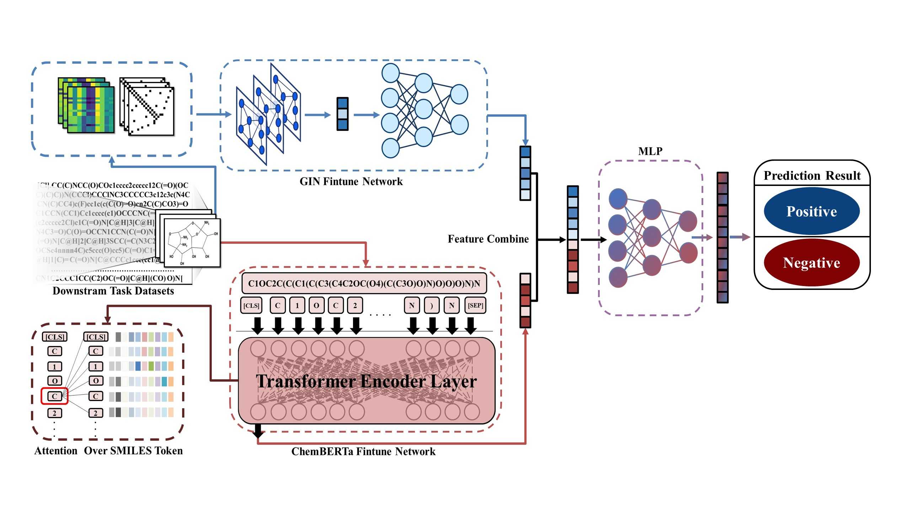
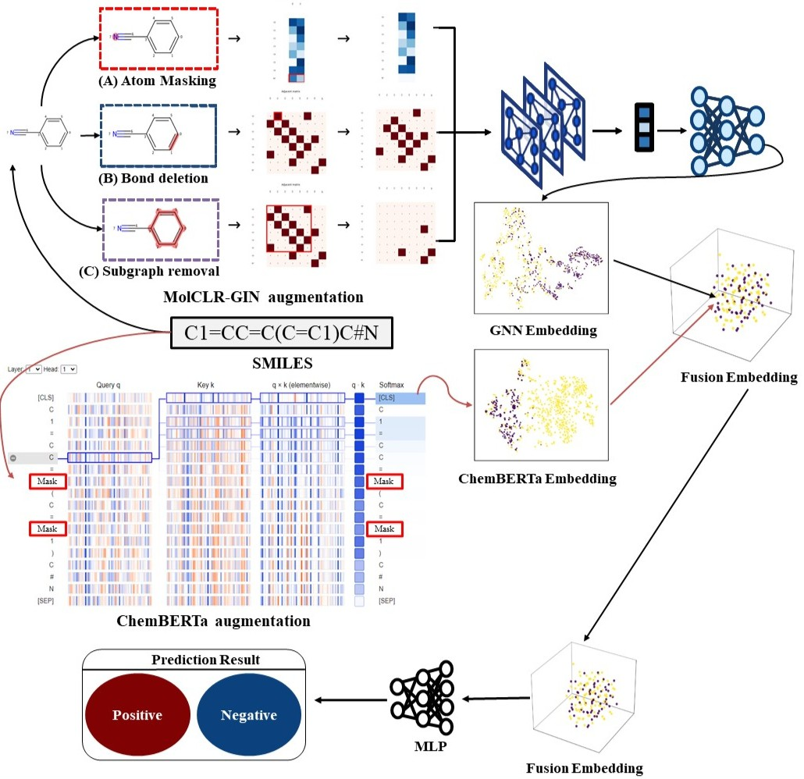
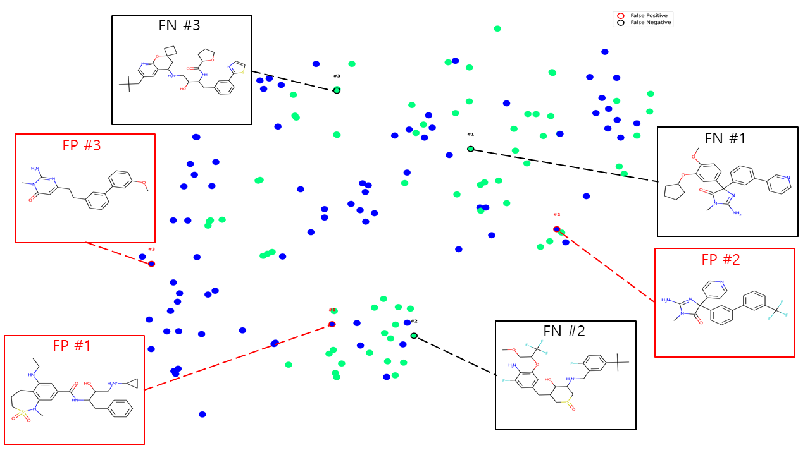

## DRGS-Net — Hybrid molecular representation (GNN + ChemBERTa)

## Overview

DRGS-Net implements a hybrid molecular representation model that concatenates:
- a graph neural network encoder (MolCLR / GIN/GCN style) producing graph embeddings
- a chemical language model embedding from ChemBERTa (Roberta-style) applied to SMILES

The combined embedding is passed to a small prediction head for downstream molecular property prediction (classification or regression).

This repository contains training/finetuning scripts, dataset wrappers, model definitions, and utilities. The hybrid model is implemented in `models/concatenate_model.py` (class `HybridModel`). The finetuning orchestration is in `DRGS-Net_finetune.py` which expects a configuration file named `config_concatenate.yaml` by default — if you only have `DRGS-Net.yaml`, copy/rename it to `config_concatenate.yaml` before running (see "Quick start").
## Methodology

Key points:
- MolCLR weights (pretrained GNN encoder) are expected under `./ckpt/<pretrained_name>/checkpoints/model.pth` (the default `fine_tune_from` in YAML is `pretrained_gin`).
- ChemBERTa model files can be referenced locally (this repo includes `ChemBERTa-77M-MLM/`) or via Hugging Face name.
- Training logs are written under `finetune/` (TensorBoard) and experiment results are saved in `experiments/`.
## Results and Visualizations


## Repository layout (high-level)

- `DRGS-Net_finetune.py` — main finetune script (iterates targets, trains and evaluates)
- `config_concatenate.yaml` / `DRGS-Net.yaml` — YAML config for training (this repo contains `DRGS-Net.yaml`)
- `models/concatenate_model.py` — HybridModel (concatenate GNN + ChemBERTa)
- `models/ginet_finetune.py`, `models/gcn_finetune.py`, ... — GNN model variants
- `dataset/` — dataset wrappers and helpers (e.g., `hybrid_dataset.py`)
- `ckpt/` — checkpoints and pre-trained weights (e.g., `pretrained_gin`, `pretrained_gcn`)
- `ChemBERTa-77M-MLM/` — local copy of ChemBERTa 77M MLM files (tokenizer & weights)

## Citation

If you use this code in research, please cite the MolCLR paper and the ChemBERTa model:

MolCLR:
```
@article{wang2022molclr,
    title={Molecular contrastive learning of representations via graph neural networks},
    author={Wang, Yuyang and Wang, Jianren and Cao, Zhonglin and Barati Farimani, Amir},
    journal={Nature Machine Intelligence},
    pages={1--9},
    year={2022},
    publisher={Nature Publishing Group},
    doi={10.1038/s42256-022-00447-x}
}
```

ChemBERTa (Hugging Face):
See the model card: https://huggingface.co/DeepChem/ChemBERTa-77M-MLM

## Quick start

1) Prepare config file

The finetune script (`DRGS-Net_finetune.py`) by default loads `config_concatenate.yaml`. If you only have `DRGS-Net.yaml`, create a copy with the expected name:

```bash
cp DRGS-Net.yaml config_concatenate.yaml
```

Edit the YAML to set `task_name`, dataset paths, `fine_tune_from` (pretrained GNN checkpoint folder under `./ckpt/`) and `hybrid_specific.chemberta_model_name` (local path or Hugging Face model id).

2) Create environment & install dependencies (suggested)

This project requires PyTorch, HuggingFace Transformers, and optional packages like RDKit and NVIDIA Apex for mixed precision.

Example (Conda, GPU):

```bash
conda create -n drgsnet python=3.8 -y
conda activate drgsnet
pip install torch torchvision --extra-index-url https://download.pytorch.org/whl/cu117
pip install transformers
# PyG (match to your torch/cuda version) — see https://pytorch-geometric.readthedocs.io/en/latest/notes/installation.html
pip install rdkit-pypi  # or conda install -c conda-forge rdkit
pip install tensorboard scikit-learn pandas numpy tqdm pyyaml
# Optional: apex for mixed precision (if you want fp16 with Apex)
# git clone https://github.com/NVIDIA/apex && cd apex && pip install -v --disable-pip-version-check --no-cache-dir ./
```

Note: Install compatible `torch-geometric` packages for your PyTorch/CUDA setup if you use PyG layers in the GNN models.

3) Prepare data

Place downstream datasets under `data/<dataset_name>/` following the MoleculeNet CSV formats. The default config uses paths like `data/bbbp/BBBP.csv` etc. See `DRGS-Net_finetune.py` for dataset mapping by `task_name`.

4) Run finetuning

```bash
python DRGS-Net_finetune.py
```

The script will:
- read `config_concatenate.yaml`
- iterate targets defined for the selected `task_name`
- create an `experiments/<TASK>_#` results folder
- write TensorBoard logs under `finetune/<timestamp>_HYBRID_<task>`

To run a single target only, edit the `config_concatenate.yaml` and set `task_name` accordingly.

## Configuration (example keys)

Important keys found in `DRGS-Net.yaml`/`config_concatenate.yaml`:

- `batch_size`, `epochs`, `eval_every_n_epochs`, `log_every_n_steps`
- `fine_tune_from` — folder name under `./ckpt/` containing MolCLR pretrained checkpoints
- `model` — GNN model parameters (num_layer, emb_dim, feat_dim, pool, ...)
- `hybrid_specific.chemberta_model_name` — local folder or Hugging Face id for ChemBERTa
- `hybrid_specific.chemberta_lr` — learning rate for ChemBERTa branch

Example excerpt (from this repo):
```yaml
batch_size: 256
epochs: 100
fine_tune_from: pretrained_gin
model:
    num_layer: 5
    emb_dim: 300
hybrid_specific:
    chemberta_model_name: "./ChemBERTa-77M-MLM"
    chemberta_lr: 1e-5
```

## Model details

- `HybridModel` (in `models/concatenate_model.py`) wraps:
    - `molclr_model`: a GIN/GCN encoder (`models/ginet_finetune.py` etc.) that outputs a graph embedding
    - `chemberta_model`: a HuggingFace `RobertaModel` that produces a SMILES embedding (CLS token)
    - `hybrid_pred_head`: MLP that takes concatenated [graph_embedding || smiles_embedding] and outputs prediction

The model loads pre-trained MolCLR weights (if available) via `load_molclr_pre_trained_weights` and loads ChemBERTa via the HF API or a local folder. The training script configures separate optimizers/learning rates for the three parts (GNN, ChemBERTa, hybrid head).

## Logging & checkpoints

- Checkpoints are saved under the TensorBoard run directory in `finetune/<timestamp>_HYBRID_<task>/<target>/checkpoints/model.pth` when improved validation occurs.
- Final experiment summaries are written under `experiments/<TASK>_<run_number>/`.

## Troubleshooting & notes

- The main finetune script expects `config_concatenate.yaml` in the working directory. If you prefer another filename, modify the script or copy your config.
- If you run out of GPU memory, reduce `batch_size` or disable loading the full ChemBERTa by setting a smaller max token length in `models/concatenate_model.py`.
- For mixed-precision training the repo attempts to import NVIDIA Apex. If you want to use Apex, install it and set `fp16_precision: True` in the YAML.

## Tested development environment

This repository and the finetune scripts were developed and tested on the following environment (useful for reproducibility):

- OS: Ubuntu 20.04 LTS
- CPU: AMD Ryzen 9 5900X
- GPU: NVIDIA RTX 3070 with CUDA 10.1
- PyTorch: 1.8.1
- PyTorch Geometric (PyG): 1.4.3
- RDKit: 2020.09.1

Suggested environment setup (conda) that matches the above tested stack:

```bash
conda create -n drgsnet python=3.8 -y
conda activate drgsnet
# Install PyTorch 1.8.1 with CUDA 10.1
conda install pytorch==1.8.1 torchvision==0.9.1 cudatoolkit=10.1 -c pytorch

# Install PyG wheels compatible with torch 1.8.1 + cu101 (select matching wheel URL)
pip install torch-scatter==2.0.5 torch-sparse==0.6.9 torch-cluster==1.5.9 torch-spline-conv==1.2.1 -f https://data.pyg.org/whl/torch-1.8.1+cu101.html
pip install torch-geometric==1.4.3

# RDKit
conda install -c conda-forge rdkit=2020.09.1

# Common extras
pip install transformers tensorboard scikit-learn pandas numpy tqdm pyyaml
```

Notes:
- Make sure your NVIDIA drivers support CUDA 10.1 for the RTX 3070; if you have a newer driver/CUDA stack you can install the matching PyTorch/CUDA wheel instead (e.g., cudatoolkit=10.2 or 11.x).
- If you prefer pip wheels for PyTorch, use the official PyTorch installation matrix at https://pytorch.org to pick the correct command for `torch==1.8.1` + your CUDA version.

## Acknowledgements

This project builds on ideas and code from:
- MolCLR (Y. Wang et al., Nature Machine Intelligence, 2022) — molecular contrastive pretraining for GNNs
- ChemBERTa — a Roberta-style chemical language model (Hugging Face model card)

Also inspired by:
- PyTorch implementation of SimCLR and pretraining frameworks for GNNs.

## License

See `LICENSE` in the repository root for license terms.

---

If you want, I can:
- add example config files for a couple of MoleculeNet tasks (BBBP, ESOL),
- add a small script to convert `DRGS-Net.yaml` -> `config_concatenate.yaml` automatically,
- or generate a minimal `requirements.txt` / `environment.yml` for reproducible setup.
Let me know which you'd like next.
